## Getting Started with JDK Flight Recorder (JFR) Using GraalVM

JDK Flight Recorder (JFR) is a monitoring tool that collects information about the Java Virtual Machine during the execution of a Java application. 

JFR is an event based tracing framework built into the Java Runtime.  It's suitable for production environments and allows correlation of data from different subsystems/software layers. JFR includes APIs for producing application level events and consuming of event streams.  JFR is designed from the start for use in production and provides extremely low overhead. 

In this example, we'll need to utilize JDK 14+ (for JFR Streaming) so I'll be using GraalVM 21.1.0 (based on JDK 16).
```
$ java -version
java version "16.0.1" 2021-04-20
Java(TM) SE Runtime Environment GraalVM EE 21.1.0 (build 16.0.1+9-jvmci-21.1-b05)
Java HotSpot(TM) 64-Bit Server VM GraalVM EE 21.1.0 (build 16.0.1+9-jvmci-21.1-b05, mixed mode, sharing)
```

We can enable recording using two methods:

* When the application is started
* After the application is started

To start recording when the app starts, there are two basic GraalVM JFR properties that can be used to enable and record data:
```
$ java -XX:+JVMCIPrintProperties | grep Flight
graal.FlightRecorder = false                                             [Boolean]
          Enable Java Flight Recorder.
graal.StartFlightRecording = ""                                          [String]
```
After the code is compiled, start the JFR session by executing the following command:
```
$ java -XX:+FlightRecorder -XX:StartFlightRecording=duration=200s,filename=flight.jfr JFRExample
```
The recording will run for **200 seconds** and store the data in a file named `flight.jfr`.

As mentioned, we can also enable recording after the application has started using a combination of commands.

First, we'll need to note the **PID** of the running Java application using `jcmd`.  Start the demo application:

```
$ java JFRExample
```
Next, identify the PID:
```
$ jcmd -l
31729 JFRExample
```
Now we can enable recording of the running application:
```
$ jcmd 31729 JFR.start duration=200s filename=flight.jfr
```
There are a number of command line parameters you can pass to `jfr`, some examples include:

Print summary of recording
```
$ jfr summary flight.jfr 
```
Print events 
```
$ jfr print flight.jfr 
```
Print events in JSON format
```
$ jfr print --json flight.jfr
```
Print GC related events 
```
$ jfr print --categories "GC" flight.jfr
```

### JFR Streaming API
Add documentation/instructions here.

#### Using jfr-datasource
Add documentation/instructions here.

### Visualizing JFR Recordings

#### Using VisualVM
Add documentation/instructions here.
#### Using JDK Mission Control (JMC)
Add documentation/instructions here.
#### Using Grafana

[Grafana](https://grafana.com/grafana/) is an open source technology that allows you to centralize the analysis, visualization, and alerting for all of your data including JFR.

#### Grafana Using a Container

```
$ docker run -d -p 3000:3000 --rm --name=grafana -e "GF_INSTALL_PLUGINS=grafana-clock-panel,grafana-simple-json-datasource" grafana/grafana
```

Login to the Grafana dashboard via [http://localhost:3000](http://localhost:3000). The default username/password is **admin/admin**.

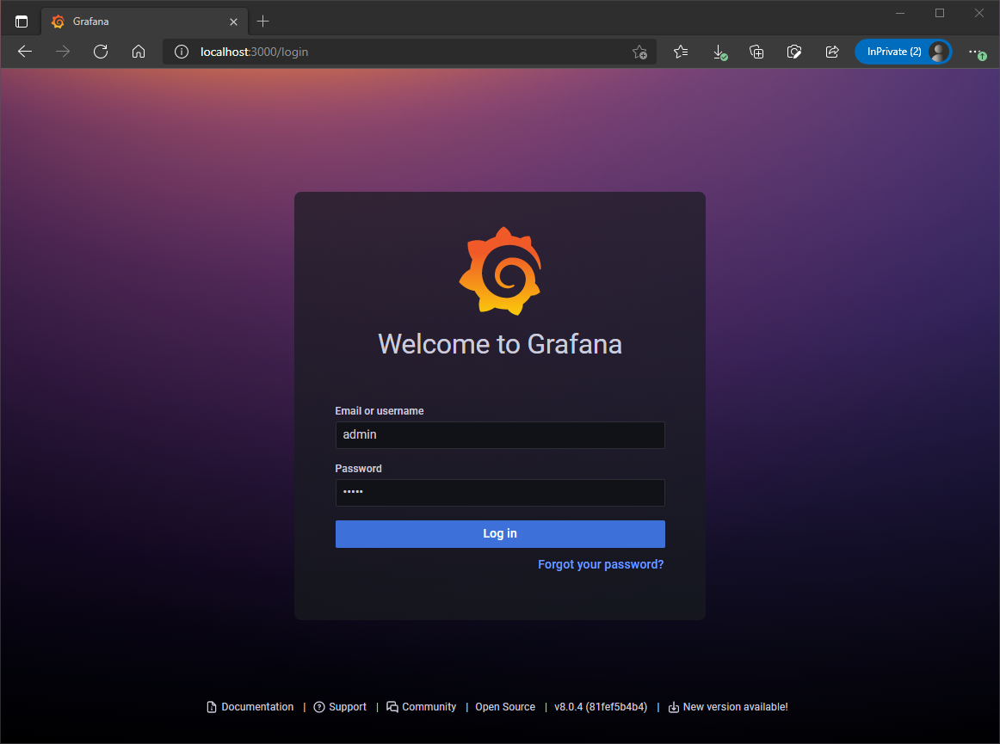

You can choose to change the admin password or simply skip that step.

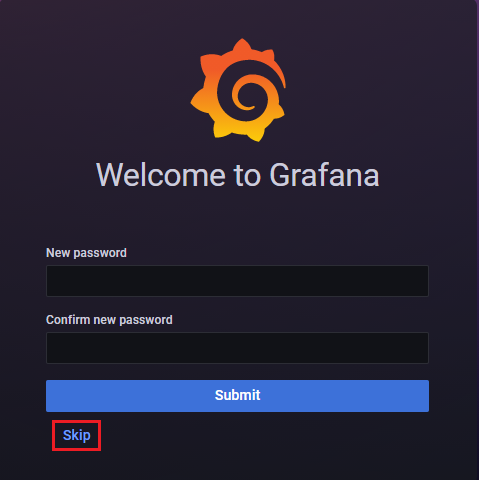


#### Prometheus Using a Container

Running Prometheus in a container is also straightforward.

```
$ docker run -p 9090:9090 prom/prometheus
```
This starts Prometheus with a sample configuration and exposes it on port 9090.

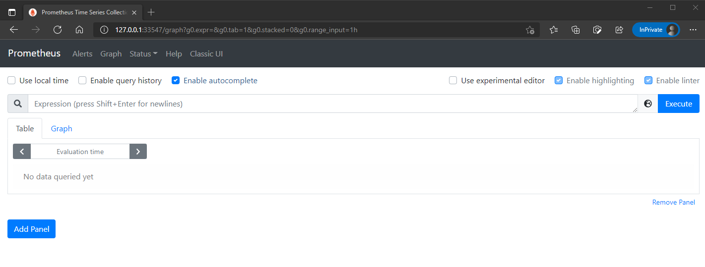


#### Connecting a Data Source & Building a Dashboard
Now that we have both Prometheus and Grafana services available, we'll need to create a Prometheus data source via the Grafana dashboard.

Click on the **gear** icon, then '**Data sources**'.

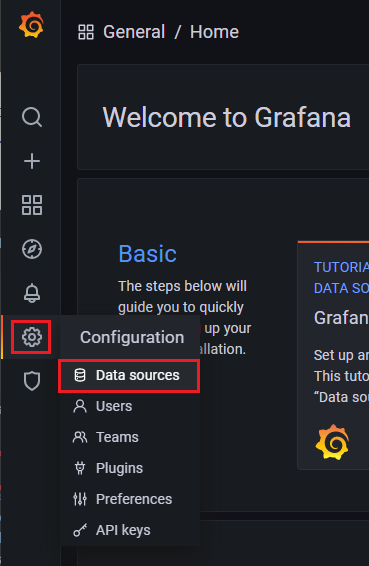

Choose '**Add data source**'.

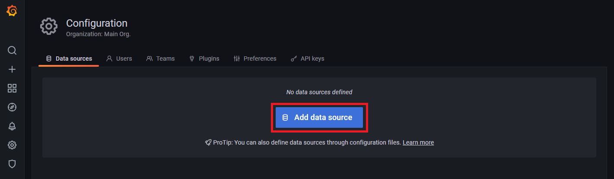

Choose '**Prometheus**', then the '**Select**' button.

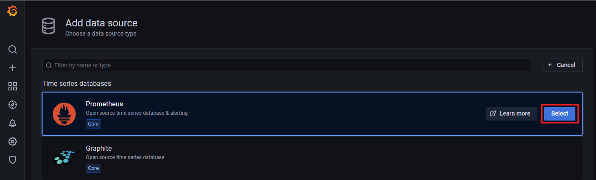

Add the URL for your Prometheus instance.

**NOTE:** For WSL2, get the IP address by executing the following command via a Windows prompt:

```
C:\> wsl hostname -I
192.1.4.23
```
Then add `http://<ip-address>:9090`


**NOTE:** For the K8s implementation, the default is `http://prometheus-server:80`. 

Then click '**Save & test**' button. If all is well, you should see a message appear indicating the '**Data source is working**'.

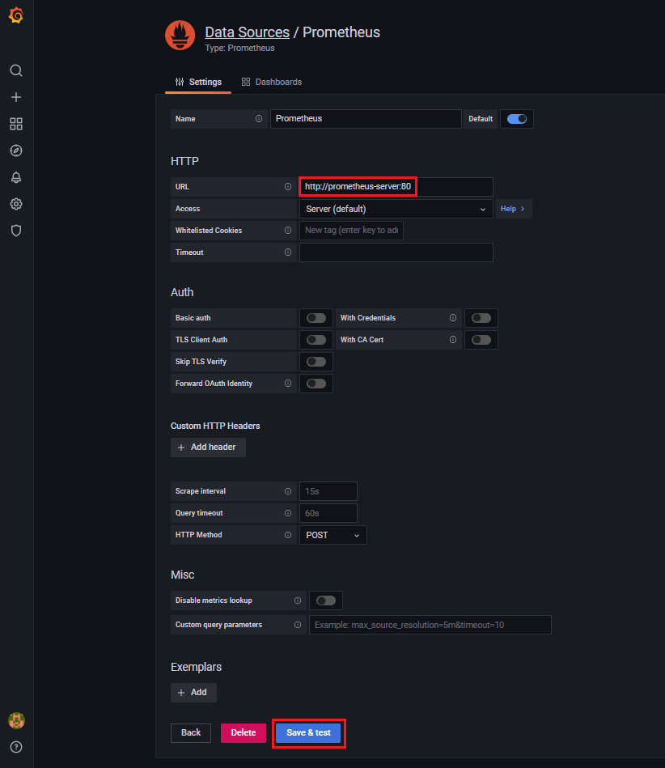

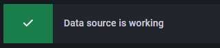

```
$ docker images
REPOSITORY                            TAG              IMAGE ID       CREATED         SIZE
prom/prometheus                       latest           9dfc442be98c   2 weeks ago     189MB
grafana/grafana                       latest           e3b53d20d03a   2 weeks ago     206MB
```
#### Adding a Dashboard

We'll add a pre-defined Java dashboard to monitor various aspects and events of our running JVM.

Login to the Grafana dashboard, click on the '**+**' icon, then '**Import**'.

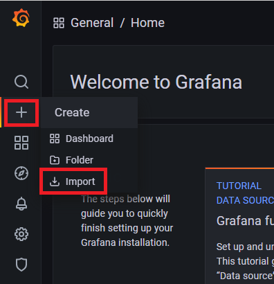

Choose the `java-dashboard.json` file from the repository. Click on `Import`.

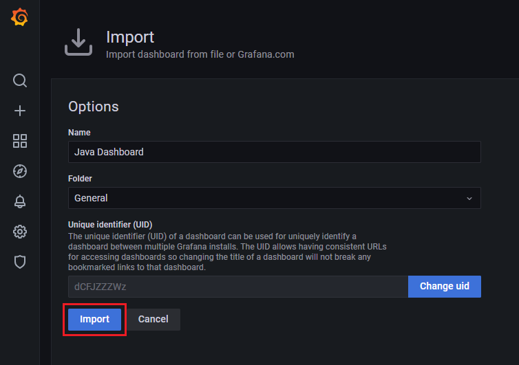

The JVM dashboard will be displayed.

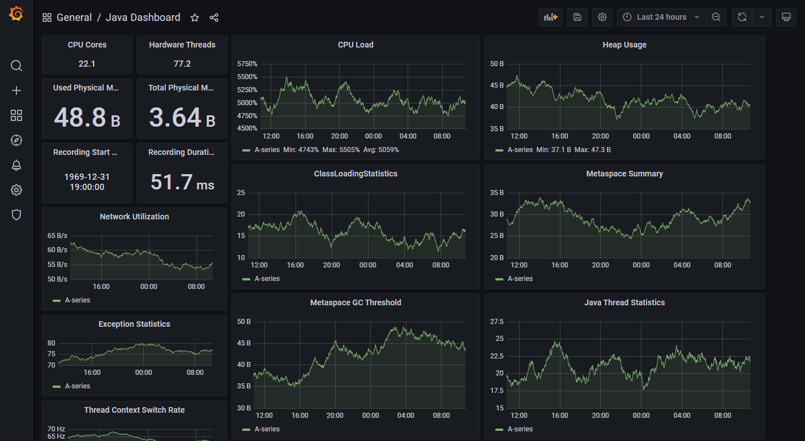

Great!  We have our Prometheus and Grafana environment up and running, plus a dashboard.

#### Using Prometheus & Grafana with Kubernetes

There are a few prerequisites for this particular demo scenario, namely Kubernetes and Helm.

First, you'll need to have a Kubernetes cluster running. In my case, I used **minikube**. You can follow the instructions here: https://minikube.sigs.k8s.io/docs/start/

Next, install **kubectl**, see the instructions here: https://kubernetes.io/docs/tasks/tools/install-kubectl/

```
$ minikube version
minikube version: v1.22.0
commit: a03fbcf166e6f74ef224d4a63be4277d017bb62e
```
```
$ minikube config set memory 8192
$ minikube config set cpus 4
$ minikube config set driver docker
$ minikube config set kubernetes-version v1.21.2
```
```
$ minikube config view
- driver: docker
- kubernetes-version: v1.21.2
- memory: 8192
- cpus: 4
```
```
$ minikube addons enable metrics-server
▪ Using image k8s.gcr.io/metrics-server/metrics-server:v0.4.2
🌟  The 'metrics-server' addon is enabled
```
```
$ minikube start
😄  minikube v1.22.0
✨  Using the docker driver based on existing profile
👍  Starting control plane node minikube in cluster minikube
🔄  Restarting existing docker container for "minikube" ...
🐳  Preparing Kubernetes v1.21.2 on Docker 20.10.5 ...
🔎  Verifying Kubernetes components...
    ▪ Using image kubernetesui/dashboard:v2.1.0
    ▪ Using image kubernetesui/metrics-scraper:v1.0.4
    ▪ Using image k8s.gcr.io/metrics-server/metrics-server:v0.4.2
    ▪ Using image gcr.io/k8s-minikube/storage-provisioner:v5
🌟  Enabled addons: storage-provisioner, default-storageclass, metrics-server, dashboard
🏄  Done! kubectl is now configured to use "minikube" cluster and "default" namespace by default
```

Check the status of minikube:
```
$ minikube status
minikube
type: Control Plane
host: Running
kubelet: Running
apiserver: Running
kubeconfig: Configured
```

Open the dashboard to view the current state of the kubernetes cluster:
```
$ minikube dashboard
🔌  Enabling dashboard ...
    ▪ Using image kubernetesui/dashboard:v2.1.0
    ▪ Using image kubernetesui/metrics-scraper:v1.0.4
🤔  Verifying dashboard health ...
🚀  Launching proxy ...
🤔  Verifying proxy health ...
🎉  Opening http://127.0.0.1:36659/api/v1/namespaces/kubernetes-dashboard/services/http:kubernetes-dashboard:/proxy/ in your default browser...
👉  http://127.0.0.1:36659/api/v1/namespaces/kubernetes-dashboard/services/http:kubernetes-dashboard:/proxy/
CTRL-Click the dashboard URL above to open the dashboard.
```
Great, our kubernetes environment is up and running. 

Finally, install [Helm](https://helm.sh/docs/intro/install/).

With Helm installed, we can add the Prometheus and Grafana repositories:
```
$ helm repo add prometheus-community https://prometheus-community.github.io/helm-charts
"prometheus-community" has been added to your repositories
```
```
$ helm repo add grafana https://grafana.github.io/helm-charts
"grafana" has been added to your repositories
```
```
$ helm repo update
Hang tight while we grab the latest from your chart repositories...
...Successfully got an update from the "grafana" chart repository
...Successfully got an update from the "prometheus-community" chart repository
Update Complete. ⎈Happy Helming!⎈
```

First, let's install Prometheus:
```
$ helm install prometheus prometheus-community/prometheus
NAME: prometheus
LAST DEPLOYED: Thu Jul 15 12:36:03 2021
NAMESPACE: default
STATUS: deployed
REVISION: 1
TEST SUITE: None
NOTES:
The Prometheus server can be accessed via port 80 on the following DNS name from within your cluster:
prometheus-server.default.svc.cluster.local


Get the Prometheus server URL by running these commands in the same shell:
  export POD_NAME=$(kubectl get pods --namespace default -l "app=prometheus,component=server" -o jsonpath="{.items[0].metadata.name}")
  kubectl --namespace default port-forward $POD_NAME 9090


The Prometheus alertmanager can be accessed via port 80 on the following DNS name from within your cluster:
prometheus-alertmanager.default.svc.cluster.local


Get the Alertmanager URL by running these commands in the same shell:
  export POD_NAME=$(kubectl get pods --namespace default -l "app=prometheus,component=alertmanager" -o jsonpath="{.items[0].metadata.name}")
  kubectl --namespace default port-forward $POD_NAME 9093
#################################################################################
######   WARNING: Pod Security Policy has been moved to a global property.  #####
######            use .Values.podSecurityPolicy.enabled with pod-based      #####
######            annotations                                               #####
######            (e.g. .Values.nodeExporter.podSecurityPolicy.annotations) #####
#################################################################################


The Prometheus PushGateway can be accessed via port 9091 on the following DNS name from within your cluster:
prometheus-pushgateway.default.svc.cluster.local


Get the PushGateway URL by running these commands in the same shell:
  export POD_NAME=$(kubectl get pods --namespace default -l "app=prometheus,component=pushgateway" -o jsonpath="{.items[0].metadata.name}")
  kubectl --namespace default port-forward $POD_NAME 9091

For more information on running Prometheus, visit:
https://prometheus.io/
```
We'll need to expose the Prometheus service:
```
$ kubectl expose service prometheus-server --type=NodePort --target-port=9090 --name=prometheus-server-ui
service/prometheus-server-ui exposed
```
```
$ minikube service prometheus-server-ui
|-----------|----------------------|-------------|---------------------------|
| NAMESPACE |         NAME         | TARGET PORT |            URL            |
|-----------|----------------------|-------------|---------------------------|
| default   | prometheus-server-ui |          80 | http://192.168.58.2:31706 |
|-----------|----------------------|-------------|---------------------------|
🏃  Starting tunnel for service prometheus-server-ui.
|-----------|----------------------|-------------|------------------------|
| NAMESPACE |         NAME         | TARGET PORT |          URL           |
|-----------|----------------------|-------------|------------------------|
| default   | prometheus-server-ui |             | http://127.0.0.1:33547 |
|-----------|----------------------|-------------|------------------------|
🎉  Opening service default/prometheus-server-ui in default browser...
👉  http://127.0.0.1:33547
❗  Because you are using a Docker driver on linux, the terminal needs to be open to run it.
```

Now we'll install Grafana:
```
$ helm install grafana grafana/grafana
W0709 13:10:55.991977   14695 warnings.go:70] policy/v1beta1 PodSecurityPolicy is deprecated in v1.21+, unavailable in v1.25+
W0709 13:10:55.994239   14695 warnings.go:70] policy/v1beta1 PodSecurityPolicy is deprecated in v1.21+, unavailable in v1.25+
W0709 13:10:56.039554   14695 warnings.go:70] policy/v1beta1 PodSecurityPolicy is deprecated in v1.21+, unavailable in v1.25+
W0709 13:10:56.039557   14695 warnings.go:70] policy/v1beta1 PodSecurityPolicy is deprecated in v1.21+, unavailable in v1.25+
NAME: grafana
LAST DEPLOYED: Fri Jul  9 13:10:55 2021
NAMESPACE: default
STATUS: deployed
REVISION: 1
NOTES:
1. Get your 'admin' user password by running:

   kubectl get secret --namespace default grafana -o jsonpath="{.data.admin-password}" | base64 --decode ; echo

2. The Grafana server can be accessed via port 80 on the following DNS name from within your cluster:

   grafana.default.svc.cluster.local

   Get the Grafana URL to visit by running these commands in the same shell:

     export POD_NAME=$(kubectl get pods --namespace default -l "app.kubernetes.io/name=grafana,app.kubernetes.io/instance=grafana" -o jsonpath="{.items[0].metadata.name}")
     kubectl --namespace default port-forward $POD_NAME 3000

3. Login with the password from step 1 and the username: admin
#################################################################################
######   WARNING: Persistence is disabled!!! You will lose your data when   #####
######            the Grafana pod is terminated.                            #####
#################################################################################
```
We'll need to expose the Grafana service:
```
$ kubectl expose service grafana --type=NodePort --target-port=3000 --name=grafana-ui
```
To uncover the Grafana admin password, execute the following command:
```
$ kubectl get secret --namespace default grafana -o jsonpath="{.data.admin-password}" | base64 --decode ; echo
yx4uaLsvLqRqljZvDsBhy30nwRwUPMI9f0iEyVBN
```
Confirm the Grafana service is available:
```
$ minikube service list
|----------------------|---------------------------|-----------------|---------------------------|
|      NAMESPACE       |           NAME            |   TARGET PORT   |            URL            |
|----------------------|---------------------------|-----------------|---------------------------|
| default              | grafana                   | No node port    |
| default              | grafana-ui                |              80 | http://192.168.58.2:31814 |
| default              | kubernetes                | No node port    |
| kube-system          | kube-dns                  | No node port    |
| kube-system          | metrics-server            | No node port    |
| kubernetes-dashboard | dashboard-metrics-scraper | No node port    |
| kubernetes-dashboard | kubernetes-dashboard      | No node port    |
| oracle-db            | oracle18xe                | listener/1521   | http://192.168.58.2:31918 |
|                      |                           | oemexpress/5500 | http://192.168.58.2:32380 |
|----------------------|---------------------------|-----------------|---------------------------|
```

```
$ minikube service grafana-ui
|-----------|------------|-------------|---------------------------|
| NAMESPACE |    NAME    | TARGET PORT |            URL            |
|-----------|------------|-------------|---------------------------|
| default   | grafana-ui |          80 | http://192.168.58.2:31814 |
|-----------|------------|-------------|---------------------------|
🏃  Starting tunnel for service grafana-ui.
|-----------|------------|-------------|------------------------|
| NAMESPACE |    NAME    | TARGET PORT |          URL           |
|-----------|------------|-------------|------------------------|
| default   | grafana-ui |             | http://127.0.0.1:43627 |
|-----------|------------|-------------|------------------------|
🎉  Opening service default/grafana-ui in default browser...
👉  http://127.0.0.1:43627
❗  Because you are using a Docker driver on linux, the terminal needs to be open to run it.
```

**NOTE:** If you're using WSL2. you may need to access the dashboard using the IP address.

#### Building a Dashboard
Follow the same instructions used with the container versions of Prometheus/Grafana to create a data source.

Let's add a dashboard to test our Prometheus and Grafana environment.

Login to the Grafana dashboard, click on the '**+**' icon, then '**Import**'.


For testing purposes, we'll load a pre-defined dashboard that displays information about your minikube environment. Add '**6417**', then click the '**Load**' button.


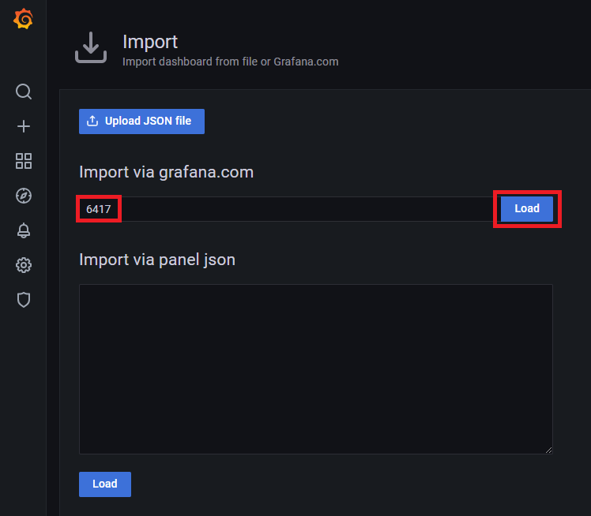

Change the data source to '**Prometheus**' and click the '**Import**' button.

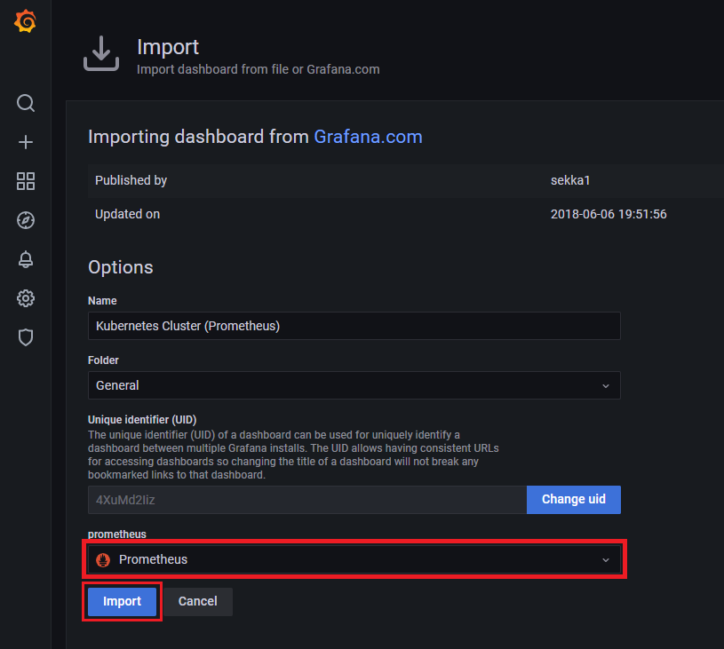

The kubernetes dashboard will be displayed with current data about your minikube cluster.

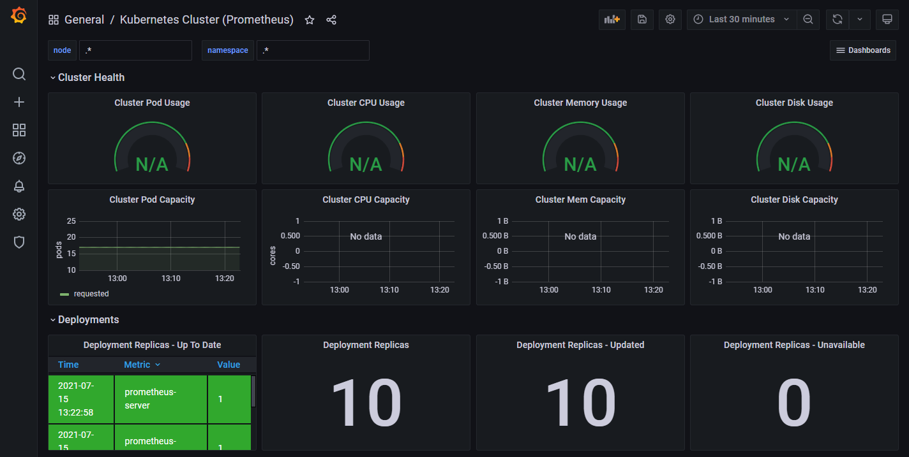
